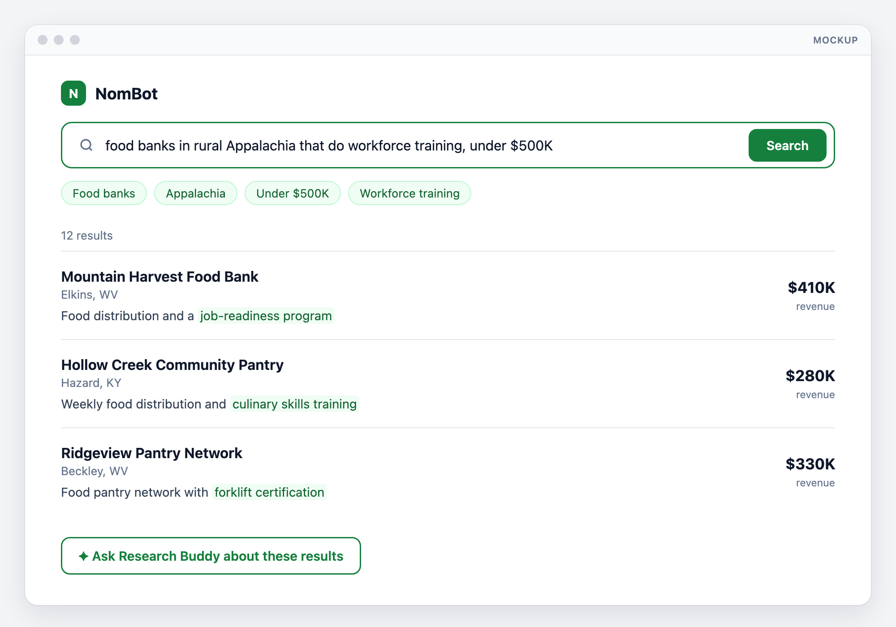
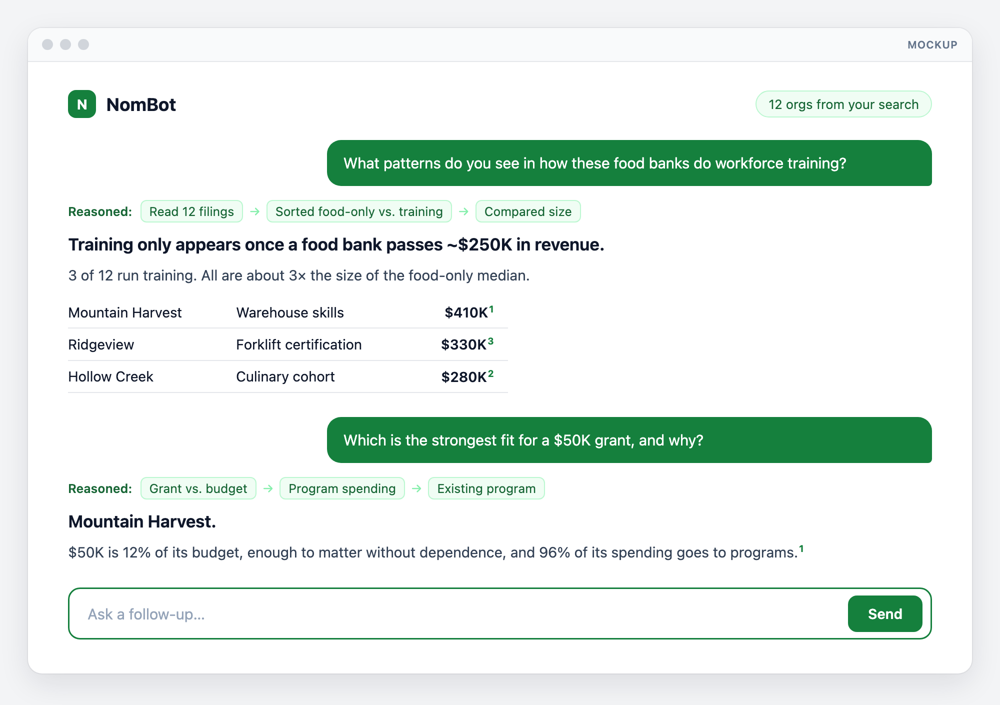

# NomBot

**Plain-language search over every US nonprofit, built on public IRS data.**
Institute on Generosity AI Fellowship · **Deadline: Dec 31, 2026** · Sister project: [GrantRadar](https://github.com/institute-on-generosity/NomBot-GrantRadar/tree/GrantRadar)

## Problem
IRS data on ~1.8M nonprofits is public but buried in raw files. Paid tools don't support plain-language search.

## Solution

| Phase | What | Ships |
|---|---|---|
| **1. Search** | Question → ranked nonprofits (EIN, location, financials, cause). Also a JSON API. | Nov 15 |
| **2. Research Buddy (RAG)** | Chat with the results. The LLM reasons over the filings, shows its steps, cites every claim. | Nov 22 |

**Search finds organizations. Research Buddy reasons about them.**

## Users

| Who | Gets |
|---|---|
| **Developers** | Raw, structured data via the read-only API |
| **IoG research team** (+ donors, program officers) | A research buddy: patterns, comparisons, recommendations |

## Experience
*Mock data.*

**Developer**
```http
GET /api/v1/search?q=food+bank+workforce+training&state=WV,KY&max_revenue=500000
```
→ JSON records: `ein`, `name`, `city`, `state`, `ntee`, `financials`, `mission`, `score`.

**Search:** *"food banks in rural Appalachia that do workforce training, under $500K"* → filter chips + ranked list.



**Research Buddy:** full questions → reasoning steps → finding → cited evidence.



## Architecture

<picture>
  <source media="(prefers-color-scheme: dark)" srcset="docs/architecture-dark.svg" />
  
</picture>

[Interactive diagram](docs/architecture.html) · Cloud target; the proof of concept runs the same parts locally.

- **Search:** question → LLM → filters + search text → one SQL + vector query → ranked results.
- **Research Buddy:** question → the shown results' 990 text → LLM reasons → answer with steps + citations. No source, no claim.

## Data

| Source | Gives | Link |
|---|---|---|
| IRS EO BMF | 1.8M orgs: name, EIN, address, NTEE | [irs.gov](https://www.irs.gov/charities-non-profits/exempt-organizations-business-master-file-extract-eo-bmf) |
| IRS SOI extract | Revenue, expenses, assets (~300K orgs) | [irs.gov](https://www.irs.gov/statistics/soi-tax-stats-annual-extract-of-tax-exempt-organization-financial-data) |
| IRS 990 e-file XML | Mission + program text (embeddings) | [irs.gov](https://www.irs.gov/charities-non-profits/form-990-series-downloads) |
| NCCS NTEE | Cause categories | [nccs](https://urbaninstitute.github.io/nccs-legacy/ntee/ntee.html) |
| ProPublica API | Per-org detail, on demand | [propublica](https://projects.propublica.org/nonprofits/api) |

## Stack

| | Local (now) | Cloud (from Oct 19) |
|---|---|---|
| Database | Postgres 17 + pgvector (Homebrew) | Supabase Pro, shared with GrantRadar |
| Data | 5 states (WV, KY, TN, VA, OH) | All US |
| ETL | Python, run by hand | GitHub Actions, monthly |
| App | Next.js, `localhost` | Vercel |
| LLM | Claude API (`@anthropic-ai/sdk`); model via `LLM_MODEL` | Same |
| Embeddings | nomic-embed-text (local, free) | Decide at cloud move: nomic or Voyage AI |

No LangChain: switching Claude models is one env var. Pipeline: [`generosity-data`](https://github.com/institute-on-generosity/generosity-data).

## Roadmap

| Dates | Work |
|---|---|
| Oct 5–18 | **Local proof of concept** |
| Oct 19–25 | Cloud: Supabase, national data, Vercel, **API live** |
| Oct 26–Nov 1 | 50-query eval, ≥90% relevant |
| Nov 2–8 | Web UI; IoG team using it |
| Nov 9–15 | Full API, refresh, user testing → **Phase 1 launch** |
| Nov 16–22 | **Research Buddy** → NomBot done |
| Nov 23–Dec 20 | GrantRadar |
| Dec 21–31 | Buffer + handoff |

## Success metrics
- ≥90% relevant results, <2s
- IoG uses it for real research by Dec 15
- ≥3 positive external users
- Every Research Buddy claim cited
- Refresh runs hands-off; <$250/mo

## Budget
**Local:** ~$2. **Cloud:** ~$30–60/mo (Supabase $25, LLM $10–35).

## Progress
📋 Tracker: [Issue #1](https://github.com/institute-on-generosity/NomBot-GrantRadar/issues/1)

**Planning**
- [x] Plan, diagram, mockups
- [x] Repo + branches (`main`, `NomBot`, `GrantRadar`)

**Oct 5–18: Local proof of concept**
- [x] Postgres + pgvector, schema
- [x] BMF: 204,564 orgs
- [x] SOI financials: 54,590 rows
- [x] 990 text: 50,971 filings, all embedded
- [x] Embeddings + index (local nomic, free)
- [x] ZIP → county + Appalachia (ARC) lookup: 34,236 ZIPs
- [x] Claude query parser (verified on 3 questions; ~2–5s)
- [x] Search page + read-only API on `localhost`
- [x] **Demo works end to end** (68 results, ~0.15s)
- [x] Early UX: exact vs. closest matches, detail pages, linked sources, sort, CSV export, inactive orgs hidden
- [x] Early UX: IRS master file viewer, history, saved (★), loading popup, caching (sort ~0.1s), animations
- [x] Apple-style UI: Claude-style sidebar, search suggestions, dark mode
- [x] Relevance score 0–100 with an AI reason on hover; weak matches folded
- [x] Editable filter chips (place, city, Appalachia, size, cause); results update in ~0.4s
- [x] IRS financial (SOI) viewer; sources open beside the org in a popover

**Oct 19–25: Cloud**
- [ ] Supabase + data migrated
- [ ] National load + embeddings
- [ ] Vercel + GitHub Actions
- [ ] **API live**

**Oct 26–Nov 1: Quality**
- [x] 50-query eval, ≥90% relevant: **91%** (was 35%) · median ~14s, goal <2s

**Nov 2–8: Web UI**
- [ ] Search page, filters; IoG using it

**Nov 9–15: Phase 1 launch**
- [ ] API docs + keys; monthly refresh
- [ ] Test with IoG + 5 external users
- [ ] **Launch**

**Nov 16–22: Research Buddy**
- [x] Multi-turn chat over results, with history
- [x] Reasoning steps + citation per claim; citations open the org
- [ ] 30-question eval, zero unsupported claims: **1 of 401** (was 12 of 406)

**Dec 21–31: Wrap-up**
- [ ] Fixes, docs, handoff
