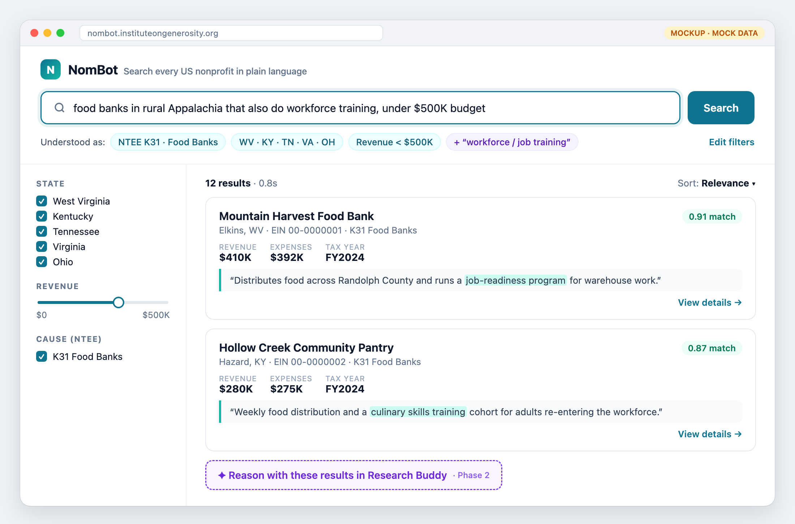
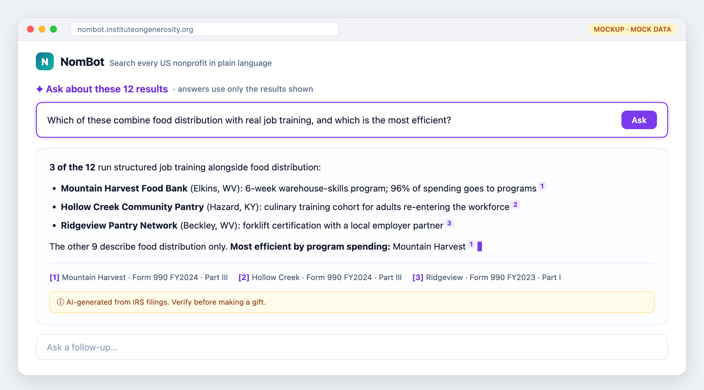

# NomBot

**Plain-language search over every registered US nonprofit, built only on public IRS data.**
An [Institute on Generosity](https://instituteongenerosity.org) AI Fellowship project · **Deadline: Dec 31, 2026**

## Problem
IRS data on ~1.8M nonprofits is public, but it is buried in raw files. Paid tools (Candid, Charity Navigator) don't support plain-language search.
A donor asking *"food banks in rural Appalachia that also do workforce training, under $500K budget"* has no good tool to use.

## Solution
Built in two phases: **search first, then RAG.**

1. **Phase 1, Search (by Nov 15).** Type a question and get a ranked list of nonprofits, each with EIN, location, financials and cause code. The same search is available as a **JSON API**.
2. **Phase 2, RAG (by Nov 22).** An **"Ask about these results"** button gives a written answer about the results on screen, for example *"Which of these also run job training?"*. Every claim cites a 990 filing.

Free and open source. Runs for about $30–60/mo.

## Target users

| Who | What they want | Served by |
|---|---|---|
| **Developers** | Raw, structured nonprofit data to build their own tools | **Phase 1, Search:** filtered + semantic search returning records (EIN, location, financials, NTEE) via the JSON API, read-only from **Oct 25** |
| **LLM users** (donors, IoG researchers, program officers, journalists) | High-reasoning answers: comparisons, summaries, "which of these…?" | **Phase 2, RAG:** written answers over search results, with every claim cited to a 990 filing |

## User experience
> All names, EINs and figures below are **mock data** for illustration.

### Developer: raw data via the JSON API (Phase 1, read-only from Oct 25)

**Question:** *"Give me food banks in West Virginia and Kentucky with revenue under $500K that do workforce training."*

```http
GET /api/v1/search?q=food+bank+workforce+training&state=WV,KY&max_revenue=500000&limit=2
```

**Outcome:** structured records, ranked by relevance, ready to load into their own tool.

```json
{
  "query": { "q": "food bank workforce training", "state": ["WV", "KY"], "max_revenue": 500000 },
  "total": 12,
  "results": [
    {
      "ein": "00-0000001",
      "name": "Mountain Harvest Food Bank",
      "city": "Elkins", "state": "WV",
      "ntee": { "code": "K31", "label": "Food Banks, Food Pantries" },
      "financials": { "tax_year": 2024, "revenue": 410000, "expenses": 392000, "assets": 215000 },
      "mission": "Distributes food across Randolph County and runs a job-readiness program for warehouse work.",
      "score": 0.91,
      "data_completeness": "full"
    },
    {
      "ein": "00-0000002",
      "name": "Hollow Creek Community Pantry",
      "city": "Hazard", "state": "KY",
      "ntee": { "code": "K31", "label": "Food Banks, Food Pantries" },
      "financials": { "tax_year": 2024, "revenue": 280000, "expenses": 275000, "assets": 90000 },
      "mission": "Weekly food distribution and a culinary skills training cohort for adults re-entering the workforce.",
      "score": 0.87,
      "data_completeness": "full"
    }
  ]
}
```

### End user: plain-language search (Phase 1, web UI from Nov 8)

**Question:** *"Food banks in rural Appalachia that also do workforce training, under $500K budget."*

**Outcome:** a ranked list with filters, in under 2 seconds. The user compares the results and decides.



### End user: reasoning over results with RAG (Phase 2, from Nov 22)

**Question** (asked about the 12 results above): *"Which of these combine food distribution with real job training, and which is the most efficient?"*

**Outcome:** a short written answer that compares and reasons across the results. Every claim links to its 990 filing.



### Side by side

| | Developer | End user: search | End user: RAG |
|---|---|---|---|
| **Asks** | An API query with filters | A plain-language question | A follow-up about the results |
| **Gets** | JSON records | A ranked list with filters | A written, cited answer |
| **Speed** | <1s | <2s | 4–10s, streamed in |
| **Who decides** | Their own code | The user | The user, helped by the AI |
| **Available** | Oct 25 | Nov 8 | Nov 22 |

## Architecture

<picture>
  <source media="(prefers-color-scheme: dark)" srcset="docs/architecture-dark.svg" />
  
</picture>

[Interactive version](docs/architecture.html) (download and open in a browser) · made with [Archify](https://github.com/tt-a1i/archify)

> This is the **cloud target**. The proof of concept runs the same components on a laptop first (see **Stack**).

**Phase 1, search:** question → LLM turns it into filters (state, NTEE, budget) plus search text → one Postgres query combines the filters with vector similarity → ranked results.

**Phase 2, RAG:** the user asks about the results → the RAG Answerer pulls those orgs' 990 text → the LLM writes an answer that cites each filing. It runs only over results already shown and **makes no claim without a source**. The JSON API stays search-only.

## Data

| Source | Provides | Notes | Download |
|---|---|---|---|
| IRS EO BMF | Name, EIN, address, NTEE, status | ~1.8M orgs; only active orgs are loaded. CSV per state/region, updated monthly | [irs.gov: EO BMF extract](https://www.irs.gov/charities-non-profits/exempt-organizations-business-master-file-extract-eo-bmf) |
| IRS SOI 990 extract | Revenue, expenses, assets | ~300K e-filers; numbers only, no text. Annual zip per form (990, 990-EZ, 990-PF) + field dictionary | [irs.gov: SOI annual extract](https://www.irs.gov/statistics/soi-tax-stats-annual-extract-of-tax-exempt-organization-financial-data) |
| IRS 990 e-file XML | Mission (Part I), programs (Part III) | The only source of text for embeddings. Monthly zip batches + index CSV per year | [irs.gov: Form 990 series downloads](https://www.irs.gov/charities-non-profits/form-990-series-downloads) |
| NCCS NTEE codes | Cause-area categories | Used for filtering | [NCCS: IRS activity codes](https://urbaninstitute.github.io/nccs-legacy/ntee/ntee.html) |
| ProPublica API | Extra detail per org | Free, no key; rate-limited, so looked up on demand, not loaded in bulk | [ProPublica Nonprofit Explorer API](https://projects.propublica.org/nonprofits/api) |

## Stack
**Local first, then cloud.** The proof of concept runs entirely on a laptop. The cloud move swaps the hosting, not the code: the same Postgres + pgvector schema moves over with `pg_dump` / `pg_restore`.

| Layer | Proof of concept (local) | Cloud (after migration) |
|---|---|---|
| Database | Postgres 16 + pgvector in Docker (`pgvector/pgvector` image) | Supabase Pro (hosted Postgres + pgvector, HNSW index) |
| Data | 5 Appalachian states (WV, KY, TN, VA, OH) | All ~1.8M US nonprofits |
| ETL | Python scripts run by hand | Same scripts on GitHub Actions, monthly |
| App + API | Next.js on `localhost:3000` | Next.js on Vercel |
| LLM | [Vercel AI SDK](https://ai-sdk.dev), any provider (one env var) | Same |
| Embeddings | `text-embedding-3-small` @ 512 dimensions | Same |

No LangChain: the core is one SQL query plus one LLM call. In the cloud, the Supabase database is shared with GrantRadar, whose logins and saved matches use Supabase Auth.

The data pipeline lives in [`generosity-data`](https://github.com/institute-on-generosity/generosity-data). [GrantRadar](https://github.com/institute-on-generosity/GrantRadar) uses the same database.

## Roadmap
**Deadline: Dec 31, 2026.** NomBot and GrantRadar are built back to back on the shared `generosity-data` pipeline, so each project gets one focused stretch.

| Dates | Work | Done when |
|---|---|---|
| Oct 5 – Oct 18 | **Local proof of concept:** Postgres + pgvector in Docker; load BMF + SOI + 990 text for 5 Appalachian states; embeddings; LLM query parsing; basic search page + read-only API on `localhost` | The demo query (*"food banks in rural Appalachia that do workforce training, under $500K"*) works end to end on a laptop |
| Oct 19 – Oct 25 | **Migrate to cloud:** Supabase Pro; full national load (~1.8M orgs); deploy to Vercel; ETL on GitHub Actions | Same demo works at a public URL; **read-only API live for developers** |
| Oct 26 – Nov 1 | 50-query eval set; tune query parsing | ≥90% relevant results on the eval set |
| Nov 2 – Nov 8 | Web UI: search, result cards, filters | IoG team using it |
| Nov 9 – Nov 15 | Full JSON API (docs, keys); monthly refresh; start testing with IoG + 5 external users | **Phase 1 launch:** search + API public |
| Nov 16 – Nov 22 | **Phase 2, RAG:** "Ask about these results" with citations | **NomBot build complete** |
| Nov 23 – Dec 20 | GrantRadar build (lighter Thanksgiving week); NomBot testing continues alongside | GrantRadar build complete |
| Dec 21 – Dec 31 | Buffer; fixes from testing; documentation; IoG handoff | **Everything done** |

## Success metrics
- ≥90% of test queries return relevant results in under 2 seconds
- IoG research uses NomBot for one real task before Dec 15
- ≥3 external users give positive feedback
- Monthly refresh runs with no manual steps
- Phase 2: 100% of RAG claims cite a filing; zero unsupported claims on a 30-question eval set
- Infrastructure stays under $250/mo

## Budget (infrastructure)

| Item | Proof of concept (Oct 5 – 18) | Cloud (from Oct 19), monthly |
|---|---|---|
| Database | $0 (Docker on a laptop) | $25 (Supabase Pro, ≈ 1–2 GB) |
| Hosting + ETL | $0 (localhost, run by hand) | $0 (Vercel, GitHub Actions) |
| Embeddings | <$1 one-time (5 states) | <$5 one-time (full load) |
| LLM query parsing | ~$1 (testing) | $5–20 |
| LLM RAG answers (phase 2) | none | $5–15 |
| **Total** | **~$2** | **~$30–60** |

## Risks

| Risk | Mitigation |
|---|---|
| BMF lists dissolved orgs | Load only active orgs; cross-check with ProPublica |
| Text only for ~300K orgs | Show how complete each org's data is; others are found by filters and keyword search |
| 990 XML formats vary by year | Parse each schema version; log and skip rows that fail |
| Free-tier API limits | Cache frequent queries; rate-limit the API |
| Local setup differs from cloud | Same Postgres version + pgvector locally and in Supabase; schema in versioned SQL migrations; migrate with `pg_dump` / `pg_restore` |
| RAG states false things about real orgs | Answer only from the results shown; require a citation for every claim; label answers as AI-generated |

## Progress

> 📋 Click-to-tick tracker: [Issue #1: NomBot progress](https://github.com/institute-on-generosity/NomBot/issues/1)

### Planning
- [x] Project plan and README
- [x] System architecture diagram
- [x] User experience mockups
- [x] Repos created: `NomBot`, `GrantRadar`, `generosity-data`
- [x] Deadline set: Dec 31, 2026

### Oct 5 – Oct 18: Local proof of concept
- [ ] Docker: Postgres 16 + pgvector running locally
- [ ] Database schema as SQL migrations (`orgs`, `financials`, `filing_text`)
- [ ] Load IRS BMF for WV, KY, TN, VA, OH (active orgs only)
- [ ] Load IRS SOI financials for those orgs
- [ ] Extract mission + program text from 990 XML
- [ ] Embeddings + pgvector index
- [ ] LLM query parser (question → filters + search text)
- [ ] Basic search page + read-only JSON API on `localhost`
- [ ] **Demo query works end to end on a laptop**

### Oct 19 – Oct 25: Migrate to cloud
- [ ] Supabase Pro project created
- [ ] Schema + data migrated (`pg_dump` / `pg_restore`)
- [ ] Full national load (~1.8M orgs) + embeddings
- [ ] Deploy to Vercel (public URL)
- [ ] ETL scripts on GitHub Actions
- [ ] **Read-only JSON API live for developers**

### Oct 26 – Nov 1: Query quality
- [ ] 50-query eval set
- [ ] ≥90% relevant results on the eval set

### Nov 2 – Nov 8: Web UI
- [ ] Search page, result cards, filters
- [ ] IoG team using it

### Nov 9 – Nov 15: Phase 1 launch
- [ ] Full JSON API (docs, API keys)
- [ ] Automated monthly refresh (GitHub Actions)
- [ ] Testing with IoG staff + 5 external users
- [ ] **Phase 1 launch:** search + API public

### Nov 16 – Nov 22: Phase 2 RAG
- [ ] "Ask about these results" with citations
- [ ] 30-question RAG eval: every claim cited, zero unsupported claims

### Dec 21 – Dec 31: Wrap-up
- [ ] Fixes from user testing
- [ ] Documentation and IoG handoff
