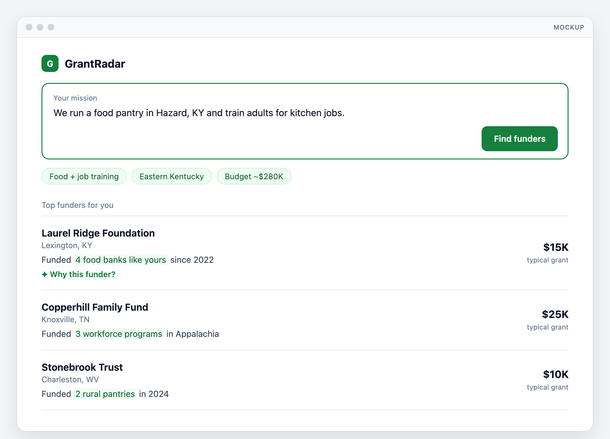
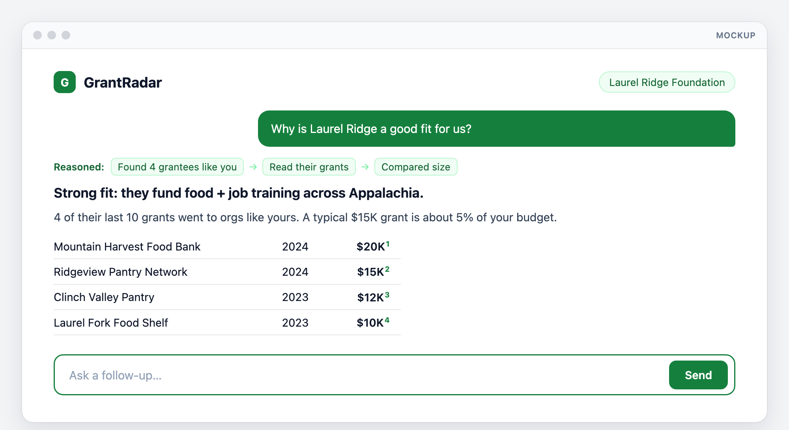

# GrantRadar

**Describe your mission. Get the foundations most likely to fund you, from public IRS data.**
Institute on Generosity AI Fellowship · **Deadline: Dec 31, 2026** · Ships as **`/grants` in the [NomBot](https://github.com/institute-on-generosity/NomBot-GrantRadar/tree/NomBot) app** (one codebase, one deploy)

## Problem
Every foundation grant is public (990-PF, Part XV), but small nonprofits can't use it. Discovery tools cost $150–400/mo.

## Solution

| Feature | What | Planned | Status |
|---|---|---|---|
| **Match** | Mission → similar nonprofits → who funded them → ranked funders | Dec 6 | ✅ **Built Oct 7** (local) |
| **Why this funder?** | LLM reasons over the funder's grants, shows steps, cites every claim | Dec 6 | ✅ **Built Oct 7** (local) |
| **Grant types** | Unrestricted vs. project vs. policy giving, read from grant purposes | — | ✅ **Built Oct 7** (local, from feedback) |
| **Research Buddy** | Follow-up questions about the matched funders; cites each funder, opens its sheet | — | ✅ **Built Oct 7** (local, from feedback) |

**A funder ranks high only if it already funded orgs like yours.**

### How matching works
1. Your mission is embedded (same local model as NomBot) and compared with the filed missions of every nonprofit that received a foundation grant: the 150 closest are candidates.
2. Claude scores each candidate's **work** 0–100 against your mission, ignoring location (embeddings over-weight place words: "rural West Virginia" pulled health clinics into an animal-rescue match). Only **≥70** counts as a group "like yours".
3. Each foundation scores the sum of ((score − 50) / 50)² over the groups like yours it paid: a few near-identical grantees beat many loose ones. Rows show ● same kind of work (≥85) and ○ closely related (70–84).
4. Filters: **gives in** a state (any of the 53 states these foundations give to; similar grantees come from the 5 loaded states), **open to applications** (drops foundations that only give to preselected charities), **typical grant** size, **grant type** (mostly unrestricted / mostly project grants).

### Grant types
- Each grant's purpose is sorted by **keyword rules** (`web/lib/grantTypes.ts`, no Claude): **unrestricted** ("general operating", "charitable purposes", "unrestricted"), **project** (a program, scholarship, building, event), **policy** (public policy, advocacy, civic engagement; victim/child advocates count as services), or **unclear** ("donation", "support", a bare cause like "education").
- **Coverage: 72%** of grants (71% of dollars) get a type. Spot check of 36 random labeled grants: 34 right, 2 debatable ("general program operation", "annual grant program 2024" → project). Policy is rare (0.2%); 17 of 20 sampled looked right.
- A row shows **"Mostly unrestricted"** or **"Mostly project grants"** only when ≥5 grants have a type, they cover ≥50% of its grant dollars, and one type has ≥60% of them: **2,277 of 6,047** foundations with grants. The funder sheet shows the split and tags each grant; "Why this funder?" gets it too.

## Users

| Who | Gets |
|---|---|
| Development directors (<$2M orgs) | Realistic funders, free |
| IoG partner orgs | Saved matches + weekly digest |
| First-time grant writers | *Why* a funder fits, with evidence |

## Experience
*Mock data.*

## Architecture

<picture>
  <source media="(prefers-color-scheme: dark)" srcset="docs/grantradar/architecture-dark-v2.svg" />
  
</picture>

[Interactive diagram](docs/grantradar/architecture.html)

**Hardest step:** grants list recipients by name + address, usually without an EIN. The matcher links them to `orgs` with a confidence score; weak links are excluded.

## Reused from NomBot
GrantRadar is NomBot plus a grants table.

| Reused | New |
|---|---|
| Database, Supabase, migrations | `grants` + `funders` tables |
| Org list (BMF) | Recipient matcher |
| 990 XML pipeline | Part XV extractor |
| SOI loader | 990-PF file |
| Mission embeddings | Funder ranking query |
| Research Buddy reasoner + panel | "Why this funder?" prompt; Buddy over the top 12 matched funders (`/api/grants/buddy`) |
| AI overview + landscape tabs | Funder figures + Claude overview over the top 15 matched funders (`web/lib/grantLandscape.ts`) |
| App, UI, API, Vercel, GitHub Actions | `/grants` pages, Supabase Auth, digest |

## Data

| Source | Gives | Link |
|---|---|---|
| IRS 990-PF XML | Grants paid (Part XV) | [irs.gov](https://www.irs.gov/charities-non-profits/form-990-series-downloads) |
| IRS EO BMF | Orgs + funders (already loaded) | [irs.gov](https://www.irs.gov/charities-non-profits/exempt-organizations-business-master-file-extract-eo-bmf) |
| IRS SOI 990-PF | Foundation assets + giving | [irs.gov](https://www.irs.gov/statistics/soi-tax-stats-annual-extract-of-tax-exempt-organization-financial-data) |
| Foundation sites | Contacts, deadlines (top ~500) | Public web |

## Roadmap

| Dates | Work |
|---|---|
| Nov 23–29 *(light)* | Grants tables + Part XV extractor; 5-state grants loaded |
| Nov 30–Dec 6 | Matcher + ranking + `/grants` + explainer → **local proof of concept** |
| Dec 7–13 | National data on existing Supabase; ships with NomBot deploy; logins |
| Dec 14–20 | 10 nonprofits test; 👍/👎; digest; scraper *(stretch)* → **done** |
| Dec 21–31 | Buffer + handoff |

## Changes from the plan
| Change | Why |
|---|---|
| **Built Oct 7** (planned Nov 23–Dec 6) | NomBot finished early; GrantRadar reuses its app, data and Research Buddy |
| **How to apply + "Invitation only"** from Part XV 2a–d | 5,582 of 8,030 foundations only give to preselected charities; applicants need to know before writing |
| **Matcher favors precision**: 51% linked, below the 70% goal | A wrong link credits the wrong charity. Unlinked recipients include individuals, government bodies, churches and out-of-state groups |
| **Assets and giving from the 990-PF XML**, not the SOI 990-PF file | Same numbers, one source per foundation |
| **Funder sheet** opens over the matches (morphs from the row) | Keeps the ranked list in place while you compare funders |
| **Claude checks "groups like yours"** (0–100 work match, ≥70 counts) | Embedding similarity alone matched on place words, ranking a health foundation third for animal rescue |
| **Starred funders + recent missions** in the sidebar (this browser only), before logins | Same habit as NomBot: come back to a funder or a past match in one click |
| **Research Buddy on `/grants`** (NomBot's panel, made configurable) | Oct 7 feedback ("for this one, especially"). Same rules and look; own conversation history |
| **Grant types** (unrestricted / project / policy) from purpose keywords | Oct 7 feedback. Keywords are instant and repeatable; 72% coverage made Claude classification unnecessary for now |
| **Standalone app** on the `GrantRadar` branch (no NomBot toggle; `/` → `/grants`) | Oct 7 feedback: different audiences. NomBot's org pages stay, since funder sheets link to grantees |
| **"How funders will see you"** (`/grants/check`): look up your nonprofit by name or EIN, see the diligence a foundation runs on your newest 990 and what to prepare | Oct 8 GSB philanthropy class: funders vet finances, board and pay before reading a proposal. Same fixed rules as NomBot's org page (`lib/flag.ts`) |
| **Landscape panel** beside the matches: **AI overview** (summary, patterns, "Where to start"), **Breakdown** (typical grant, applications, grant type, home state), **Ask** (grant ranges by grantee budget), **Calendar** (open funders by deadline month; pick a month to list them), **Peers** (groups like yours with the most funders) | Oct 7 feedback: zoom out to patterns, not only details. Same panel as NomBot's results page |
| **Deadlines read by rules**, not Claude (months, "12/31", "none" → any time) | 79% of filed deadline answers parse; instant and repeatable. Can't yet tell a scholarship deadline from a grant deadline |

## Success metrics
- ≥10 nonprofits test by Dec 20
- ≥70% of matches rated relevant
- ≥70% of grants linked to a recipient (**51%** so far, in-state recipients)
- Results <3s (**~0.5s** cached, ~2–5s new mission); every explanation cited
- Adds <$50/mo

## Budget
**Local:** ~$1. **Cloud:** ~$5–15/mo extra (shares NomBot's Supabase).

## Feedback
### Oct 7, 2026: IoG demo (NomBot + GrantRadar)
**Main message: be choosy.** Every reviewer will want more fields; adding everything "frankensteins" the product. Pick the audience first and only add what serves it.

| Feedback | Plan |
|---|---|
| **Typical grant** is very helpful | Keep it prominent |
| Show **restricted vs. unrestricted** giving, and whether a funder backs programs or policy | ✅ **Done Oct 7:** grant purposes sorted into unrestricted / project / policy; row tag, sheet breakdown, filter |
| Add **Research Buddy** to GrantRadar | ✅ **Done Oct 7:** NomBot's Buddy over the top matched funders: facts, how to apply, grant types, groups like yours |
| Zoom **out** to patterns, not only details | ✅ **Done Oct 8:** landscape panel beside the matches: AI overview with next steps, breakdown, peers |
| GrantRadar and NomBot serve **different audiences** | ✅ **Oct 8:** the `GrantRadar` branch runs standalone: no NomBot toggle, titled GrantRadar, home page is `/grants` |
| **Real-time budget** and fundraising gap | Not in public data; would need self-reporting + verification |

**Next steps**
- **Competitor scan:** Grant Guardian, a new grant-matching startup, Renaissance Philanthropy; state GrantRadar's unique value.
- **User testing:** nonprofit development staff and foundation staff; PostHog for usability analytics.
- **Infrastructure:** Vercel Pro, Supabase Pro or Neon, PostHog.
- **Data privacy:** agree a policy before handling financial data.

## Progress
> ✅ **Oct 7, 2026: local proof of concept built**, ~8 weeks ahead of plan: grants loaded for 5 states, matcher, ranking, `/grants` pages and "Why this funder?". Recipient linking is at 51% (goal 70%).

**Planning**
- [x] Plan, diagram, mockups
- [x] Lives in `NomBot-GrantRadar`, branch `GrantRadar`

**Nov 23–29: Grants data**
- [x] `grants` + `funders` migration (generosity-data `007`)
- [x] Part XV extractor (`etl/load_grants.py`): grants paid + how to apply + invitation-only flag
- [x] 990-PF financials: assets and grants paid, read from the 990-PF itself
- [x] 5-state grants loaded: **8,030 foundations, 102,725 grants**

**Nov 30–Dec 6: Local proof of concept**
- [ ] Recipient matcher (≥70% linked): **51%** of grants to recipients in the 5 states (exact name, then trigram ≥0.7 same city / ≥0.9 elsewhere)
- [x] Funder ranking
- [x] `/grants` match page
- [x] "Why this funder?" (streams, cites each grant)
- [x] Grant types: unrestricted vs. project vs. policy (feedback, Oct 7)
- [x] Research Buddy on `/grants` (feedback, Oct 7)
- [x] Landscape panel: AI overview + breakdown + ask size + deadline calendar + peers (feedback, Oct 7)
- [x] "How funders will see you": FLAG check on your own 990 with what to prepare
- [x] **Demo works locally**

**Dec 7–13: Cloud**
- [ ] National 990-PF load
- [ ] `/grants` live on NomBot deploy
- [ ] Logins + saved matches (in-browser **Starred funders** and **Recent missions** already work; logins will sync them)

**Dec 14–20: Test + launch**
- [ ] 10 nonprofits testing, 👍/👎
- [ ] Weekly digest
- [ ] Foundation scraper *(stretch)*
- [ ] **Done**

**Dec 21–31: Wrap-up**
- [ ] Fixes, docs, handoff
