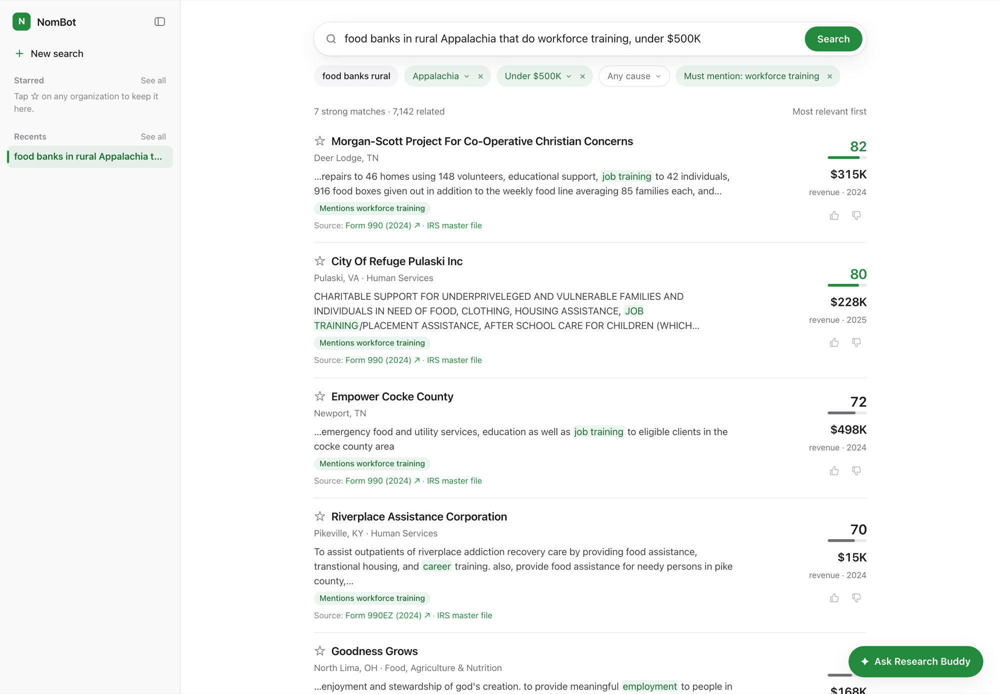
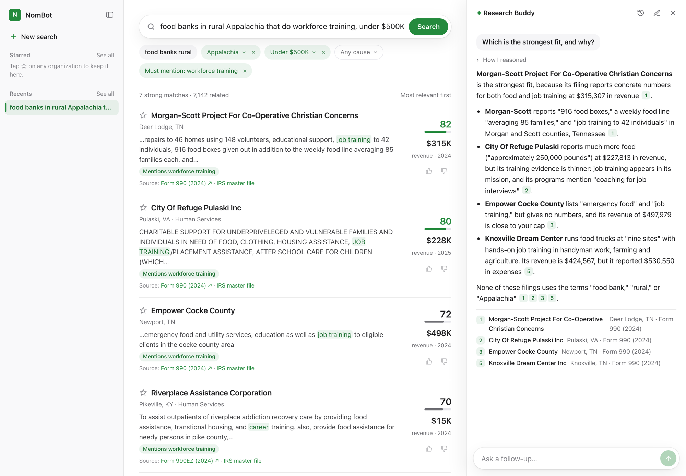

# NomBot

**Plain-language search over every US nonprofit, built on public IRS data.**
Institute on Generosity AI Fellowship · **Deadline: Dec 31, 2026** · Sister project: [GrantRadar](https://github.com/institute-on-generosity/NomBot-GrantRadar/tree/GrantRadar)

## Problem
IRS data on ~1.8M nonprofits is public but buried in raw files. Paid tools don't support plain-language search.

## Solution

| Phase | What | Planned | Status |
|---|---|---|---|
| **1. Search** | Question → ranked nonprofits (EIN, location, financials, cause). Also a JSON API. | Nov 15 | ✅ **Built Oct 7** (local) |
| **2. Research Buddy (RAG)** | Chat with the results. The LLM reasons over the filings, shows its steps, cites every claim. | Nov 22 | ✅ **Built Oct 7** (local) |

**Search finds organizations. Research Buddy reasons about them.**

### Built beyond the plan
| Area | Feature |
|---|---|
| **Ranking** | **Relevance score** 0–100 per result, with Claude's one-line reason on hover · strong matches first, weaker ones folded under "Show N weaker matches" |
| **Filters** | **Editable chips** read from the question: state, city, **Appalachia region**, budget, cause, "must mention" · results update in ~0.4s |
| **Search** | **Suggestions** under the search box · **exact-mention** badges · include tiny/inactive orgs · **CSV export** |
| **Org detail** | **Staff and volunteers** (990 Part I), All-volunteer badge |
| **Sources** | **IRS master file** and **SOI financial** viewers: every number links to its exact row · open beside the org in a popover |
| **Analysis panel** | Results on the left (~60%); a sticky panel on the right (~40%) with tabs: **Overview** (AI summary, cited patterns, related searches), **Breakdown** (size, places, causes, team), **Map** (counties, Appalachia shaded), **Themes** (kinds of work, by Claude), **Funders** (foundations that fund these orgs, from 990-PF grants); hover-only for now |
| **Compare** | Pick 2–4 results (button in each row's right column) → side-by-side finances, staff, volunteers, mission |
| **Research Buddy** | Docked chat panel · **reasoning steps** shown · citations open the org · **chat history** per search |
| **Personal** | **History** and **starred (★)** organizations, sorted into **folders**, in a Claude-style sidebar |
| **Quality** | 👍/👎 **votes** on results · **search eval** (50 questions, 91%) · **Buddy eval** (30 questions, 1 unsupported claim of 401) |
| **Design** | Apple-style UI, **dark mode**, centered loading card with steps |

## Users

| Who | Gets |
|---|---|
| **Developers** | Raw, structured data via the read-only API |
| **IoG research team** (+ donors, program officers) | A research buddy: patterns, comparisons, recommendations |

## Experience
*Real screenshots of the local app, Oct 7, 2026 (5-state data).*

**Developer**
```http
GET /api/v1/search?q=food+bank+workforce+training&state=WV,KY&max_revenue=500000
```
→ JSON records: `ein`, `name`, `city`, `state`, `ntee`, `financials`, `mission`, `score`.

**Search:** *"food banks in rural Appalachia that do workforce training, under $500K"* → editable filter chips (Appalachia, under $500K, must mention workforce training) → strong matches ranked by relevance score, each with revenue, the matching filing text and its IRS source.



**Research Buddy:** a follow-up about the results → "How I reasoned" (expandable) → a direct answer → bullets citing each filing [n] → the sources list.



## Architecture

<picture>
  <source media="(prefers-color-scheme: dark)" srcset="docs/architecture-dark.svg" />
  
</picture>

[Interactive diagram](docs/architecture.html) · Cloud target; the proof of concept runs the same parts locally.

> Diagram out of date: the **AI overview**, **Landscape** (incl. funders from GrantRadar's `grants` table) and **Compare** aren't drawn yet.

- **Search:** question → Claude parser → filters + search text → one SQL + vector query (top 40) → Claude scores each 0–100 with a reason → strong matches first, weaker ones folded.
- **Research Buddy:** follow-up question → top 15 ranked results' 990 text → Claude reasons (steps shown) → answer citing [n] for every claim. No source, no claim.
- **Landscape:** the 200 closest orgs (same filters and ranking) → counts by size, city, cause, team; counties via `zip_regions`; funders via `grants`; themes by Claude.
- **AI overview:** the scored strong matches (up to 40) + computed figures (sizes, places, causes, team sizes) → Claude → summary, patterns [n], related searches.
- **Regions:** ZIP → county lookup (`zip_regions`) powers the Appalachia filter (ARC's 420 counties).

## Data

| Source | Gives | Link |
|---|---|---|
| IRS EO BMF | 1.8M orgs: name, EIN, address, NTEE | [irs.gov](https://www.irs.gov/charities-non-profits/exempt-organizations-business-master-file-extract-eo-bmf) |
| IRS SOI extract | Revenue, expenses, assets (~300K orgs) | [irs.gov](https://www.irs.gov/statistics/soi-tax-stats-annual-extract-of-tax-exempt-organization-financial-data) |
| IRS 990 e-file XML | Mission + program text (embeddings) | [irs.gov](https://www.irs.gov/charities-non-profits/form-990-series-downloads) |
| NCCS NTEE | Cause categories | [nccs](https://urbaninstitute.github.io/nccs-legacy/ntee/ntee.html) |
| ProPublica API | Per-org detail, on demand | [propublica](https://projects.propublica.org/nonprofits/api) |

## Stack

| | Local (now) | Cloud (from Oct 19) |
|---|---|---|
| Database | Postgres 17 + pgvector (Homebrew) | Supabase Pro, shared with GrantRadar |
| Data | 5 states (WV, KY, TN, VA, OH) | All US |
| ETL | Python, run by hand | GitHub Actions, monthly |
| App | Next.js, `localhost` | Vercel |
| LLM | Claude API (`@anthropic-ai/sdk`): parse, relevance scoring, Research Buddy; model via `LLM_MODEL` | Same |
| Embeddings | nomic-embed-text (local, free) | Decide at cloud move: nomic or Voyage AI |

No LangChain: switching Claude models is one env var. Pipeline: [`generosity-data`](https://github.com/institute-on-generosity/generosity-data).

## Roadmap

| Dates | Work |
|---|---|
| Oct 5–18 | **Local proof of concept** |
| Oct 19–25 | Cloud: Supabase, national data, Vercel, **API live** |
| Oct 26–Nov 1 | 50-query eval, ≥90% relevant |
| Nov 2–8 | Web UI; IoG team using it |
| Nov 9–15 | Full API, refresh, user testing → **Phase 1 launch** |
| Nov 16–22 | **Research Buddy** → NomBot done |
| Nov 23–Dec 20 | GrantRadar |
| Dec 21–31 | Buffer + handoff |

## Changes from the plan
| Change | Why |
|---|---|
| **Relevance scoring** (Claude scores the top 40, 0–100, with a reason) | Vector + keyword search alone was 35–50% relevant; scoring lifted it to 91% |
| **Research Buddy built early** (Oct 6–7, planned Nov 16–22) | Fastest way to test the "reason over filings" idea |
| **Appalachia region filter** (ZIP → county → ARC list) | State filters can't express "rural Appalachia" |
| **Source viewers** for the IRS master file and SOI financials | Every number links to the exact row it came from |
| **Search takes ~6–14s, not <2s** | Scoring costs time; results show in ~0.5s and re-sort when scores arrive |

## Success metrics
- ≥90% relevant results (**91%** ✅), <2s (results show in ~0.5s; scores ~6–14s)
- IoG uses it for real research by Dec 15
- ≥3 positive external users
- Every Research Buddy claim cited (**1 unsupported of 401** in the 30-question eval)
- Refresh runs hands-off; <$250/mo

## Budget
**Local:** ~$2. **Cloud:** ~$30–60/mo (Supabase $25, LLM $10–35).

## Feedback
### Oct 7, 2026: IoG demo (NomBot + GrantRadar)
**Main message: be choosy.** Every reviewer will want more fields; adding everything "frankensteins" the product. Pick the audience first (foundation program officers vs. individual donors) and only add what serves it.

| Feedback | Plan |
|---|---|
| NomBot zooms **in** on details but not **out** to patterns across the landscape | ✅ **AI overview** + **Landscape** panel (breakdown bars, county map, themes, funders) + **Compare** |
| Show **staff and volunteer counts** (990 Part I lines 5–6) | ✅ On org detail, with an **All-volunteer** badge (33,331 orgs report staff; 7,057 have none) |
| **Starred folders** by category (e.g. youth mentoring vs. arts education) | ✅ Folder picker on starred orgs; folder tabs on Starred; folders in the sidebar |
| **Recommendations** based on past questions | ✅ First step: 3 "Explore" searches in the AI overview (based on the current question) |
| **Real-time budget** and fundraising gap | Not in public data; would need nonprofits to self-report + verification |
| Looks like Google, sidebar like Claude: familiar for people who aren't AI-savvy | Keep; matters for individual donors |
| NomBot and GrantRadar serve **different audiences** | One app with a toggle while testing; standalone later |

**Next steps**
- **Competitor scan:** Grant Guardian, Candid-style tools, a new grant-matching startup, Renaissance Philanthropy; state NomBot's unique value.
- **User testing:** two demo audiences (foundation staff, individual donors); a feedback session with former program officers; PostHog for usability analytics.
- **Infrastructure:** Vercel Pro (shareable link), Supabase Pro or Neon (pgvector), PostHog.
- **Data privacy:** agree a policy before any project handles financial data.

## Progress
> ✅ **Oct 7, 2026: Search and Research Buddy both built** on the local proof of concept, 5–6 weeks ahead of plan. Still to do: cloud, national data, user testing and launch.

📋 Tracker: [Issue #1](https://github.com/institute-on-generosity/NomBot-GrantRadar/issues/1)

**Planning**
- [x] Plan, diagram, mockups
- [x] Repo + branches (`main`, `NomBot`, `GrantRadar`)

**Oct 5–18: Local proof of concept**
- [x] Postgres + pgvector, schema
- [x] BMF: 204,564 orgs
- [x] SOI financials: 54,590 rows
- [x] 990 text: 50,971 filings, all embedded
- [x] Embeddings + index (local nomic, free)
- [x] ZIP → county + Appalachia (ARC) lookup: 34,236 ZIPs
- [x] Claude query parser (verified on 3 questions; ~2–5s)
- [x] Search page + read-only API on `localhost`
- [x] **Demo works end to end** (68 results, ~0.15s)
- [x] Early UX: exact vs. closest matches, detail pages, linked sources, sort, CSV export, inactive orgs hidden
- [x] Early UX: IRS master file viewer, history, saved (★), loading popup, caching (sort ~0.1s), animations
- [x] Apple-style UI: Claude-style sidebar, search suggestions, dark mode
- [x] Relevance score 0–100 with an AI reason on hover; weak matches folded
- [x] Editable filter chips (place, city, Appalachia, size, cause); results update in ~0.4s
- [x] IRS financial (SOI) viewer; sources open beside the org in a popover

**Oct 19–25: Cloud**
- [ ] Supabase + data migrated
- [ ] National load + embeddings
- [ ] Vercel + GitHub Actions
- [ ] **API live**

**Oct 26–Nov 1: Quality**
- [x] 50-query eval, ≥90% relevant: **91%** (was 35%) · median ~14s, goal <2s

**Nov 2–8: Web UI**
- [ ] Search page, filters; IoG using it

**Nov 9–15: Phase 1 launch**
- [ ] API docs + keys; monthly refresh
- [ ] Test with IoG + 5 external users
- [ ] **Launch**

**Nov 16–22: Research Buddy**
- [x] Multi-turn chat over results, with history
- [x] Reasoning steps + citation per claim; citations open the org
- [ ] 30-question eval, zero unsupported claims: **1 of 401** (was 12 of 406)

**Dec 21–31: Wrap-up**
- [ ] Fixes, docs, handoff
